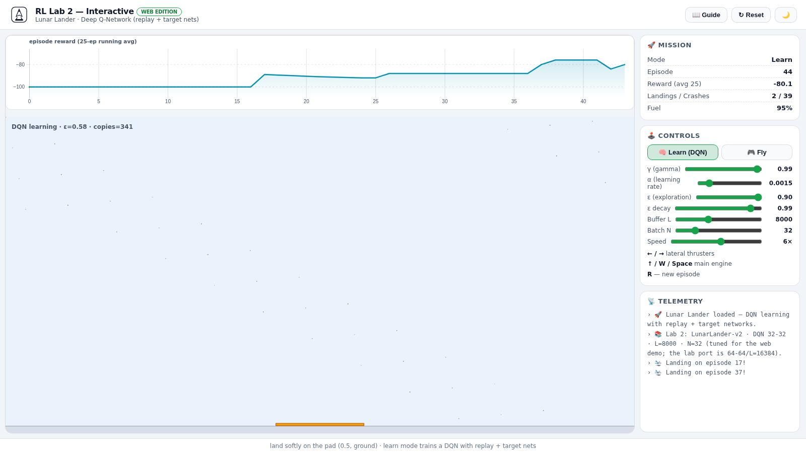
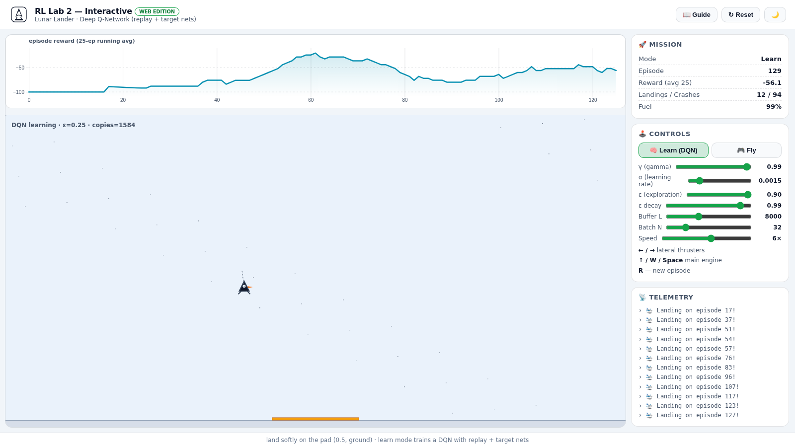

# 🤖 RL Lab 2 — Deep Q-Network (KTH/UPM, 2021)

[](https://www.python.org/)
[](https://pytorch.org/)
[](tests/)
[](https://alejp1998.github.io/rl_lab2/)

> **▶️ Play it live:** <https://alejp1998.github.io/rl_lab2/> — train the DQN or fly the lander yourself in your browser.

A **Deep Q-Network** trained from scratch on **LunarLander-v2** (OpenAI Gym),
built as part of the KTH/UPM Reinforcement Learning course (2021).

| Component | Value (lab) | Value (web edition) |
|---|---|---|
| Network | 8 → 64 → 64 → 4 | 5 → 32 → 32 → 4 |
| Experience replay `L` | 16384 | adjustable (default 8000) |
| Target update `C` | `L/N` = 256 | every 64 steps |
| Batch `N` | 64 | adjustable (default 32) |
| Exploration | ε-greedy, decays from 0.99 | decays from 0.9 |

Team: Alejandro Jarabo-Peñas · Xavier de Gibert Duart (KTH Royal Institute of
Technology, 2021).

### 🖼️ Screenshots

| DQN learning | Manual flight |
|---|---|
|  |  |
## 🎮 Interactive web edition

**[https://alejp1998.github.io/rl_lab2/](https://alejp1998.github.io/rl_lab2/)**
lets you fly the lander AND watch the DQN learn in your browser:

- **🧠 Learn mode**: a DQN with experience replay, target networks and Adam
  updates trains live — adjust γ, α, ε, decay, buffer size, batch size and
  speed while it runs, and watch the reward curve climb and landings accumulate.
- **🎮 Fly mode**: manual control (`← / →` lateral thrusters, `↑ / Space` main
  engine). Land softly on the pad for +100.
- The JavaScript core (`webgame/js/rl2-core.js`) is a 1:1 port of
  `problem_1/dqn.py` (network, replay buffer, ε-greedy) with a matching
  `node:test` suite.

## 🧪 Quality gates

```bash
pip install -e ".[dev]"
pytest -q -m "not slow"   # fast unit tests (network, buffer, running average)
pytest -q                 # + end-to-end dqn() smoke on CartPole
ruff check .
node --test webgame/tests/*.test.js
```

> LunarLander itself needs `gym[box2d]` (system `swig`/`box2d` build); the
> Python unit tests run without it — the end-to-end smoke test trains the
> lab's `dqn()` on CartPole to exercise the same code path.

## 📁 Layout

```
problem_1/  dqn.py (network, replay buffer, DQN) + problem_1.py, dqn_vs_random.py,
            DQN_check_solution.py, dqn_sol_analysis.py, trained models in models/
tests/      pytest suite
webgame/    interactive Lunar Lander edition + JS core + node tests
```
